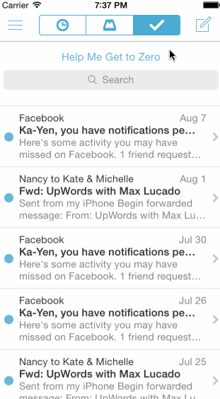

Mailbox
=======

iOS Application - Mailbox

Mailbox 
Terra Oldham

This project is an iOS app that simulates an inbox. This project allows users to "Archive" and "Delete" a message, use the segmented control to perform these actions, and see beautiful colors.

- [x] Initial revealed background is grey on left or right pan. 
- [x] Message will return to original position if dragged less than 60 points
- [x] After this point, the message will change colors and show the later icon.
- [x] When released in yellow, the message will continue and the "Reschedule" screen will appear.
- [x] If the drag continues, a pink background is displayed. If released in the pink background, it will continue and show the "List" screen.
- [x] Scroll view/messages shift up anytime a message is sent off screen. 
- [x] Icon changes from clear to opaque and green fades to red into each other on drag right.
- [x] If released in green, the message returns to its initial position.
- [x] If released in red, the message is "deleted" and moved off screen.
- [x] Optional: Tapping the segmented control in the title should swipe views in from the left or right.

